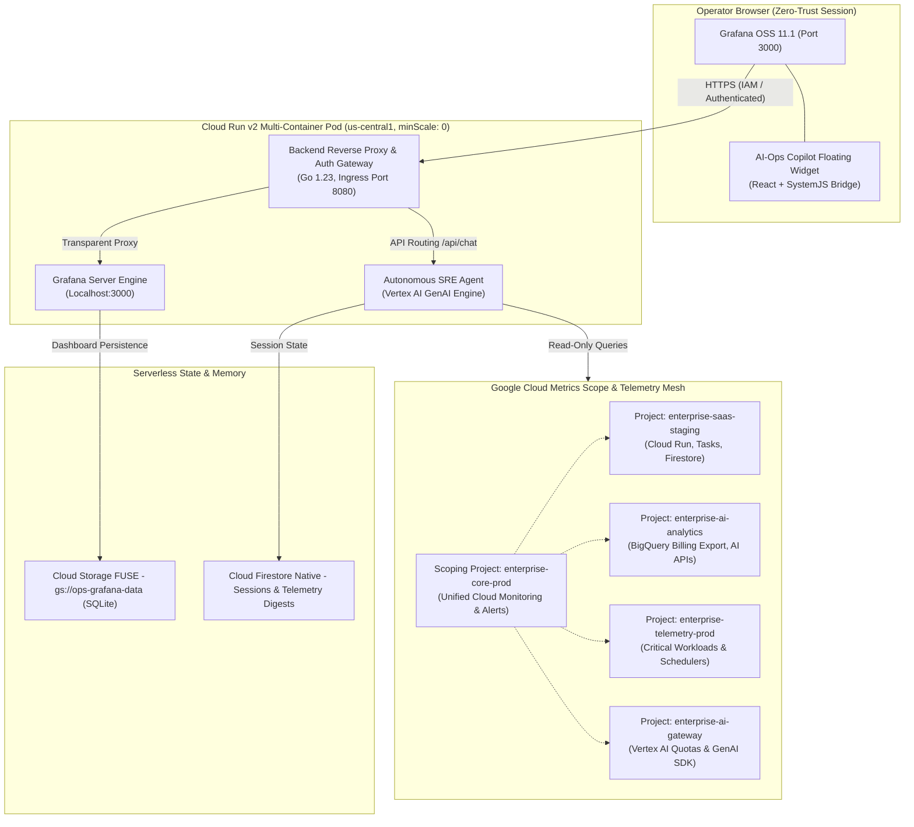

# Technical Architecture: Serverless AI-Ops Copilot & Grafana (Google Cloud)

**Status:** Technical Architecture Specification  
**Deployment Region:** `us-central1`  
**Host Project:** Central Telemetry Scoping Anchor (`enterprise-core-prod`)  
**Supervised Scope:** Multi-project Google Cloud & Firebase ecosystem  

---

## 1. Overview and Core Design Principles

The **AI-Ops Copilot** is an enterprise observability and autonomous operations (*Autonomous SRE*) platform designed to unify visibility across interconnected Google Cloud and Firebase projects. It pairs a **Grafana OSS** visualization frontend with an autonomous **Go 1.23 agent sidecar** powered by Google Cloud Vertex AI (`gemini-3.8-flash`).



### Guiding Principles:
1. **Zero-Idle Cost (Strict FinOps):** No permanently running compute resources. Both Grafana and the Go sidecar scale down to zero (`minScale: 0`), incurring zero compute cost when idle.
2. **Co-located Serverless Sidecar:** Grafana (presentation layer) and the Go agent (analytical engine and tool executor) reside within the same Cloud Run pod, communicating over `localhost` with shared storage volumes.
3. **Pre-computed Telemetry Digests:** Periodic background jobs compile high-level system health summaries into Cloud Firestore, allowing the agent to answer broad status questions in milliseconds without scanning millions of cold log entries.
4. **Zero-Trust Security & Identity:** No public ports, static IP bindings, or hardcoded credentials. Access is strictly mediated via Google Cloud IAM or Identity-Aware Proxy (IAP).
5. **Decoupled Persistence:** Container instances are completely ephemeral and stateless. Dashboards persist in Cloud Storage via GCS FUSE volume mounting, while conversational memory persists in Cloud Firestore.

---

## 2. Ingress & Pod Architecture

The multi-container Cloud Run deployment is structured to balance high security with low latency:

```text
                              AUTHENTICATED OPERATOR
                                (ops-lead@example.com)
                                          │
                                          │ HTTPS Ingress
                                          ▼
                      ┌───────────────────────────────────────┐
                      │   Google Cloud IAM / IAP (Ingress)    │
                      │  (Validates Google Account Identity)  │
                      └───────────────────┬───────────────────┘
                                          │
                                          ▼
┌────────────────────────────────────────────────────────────────────────────────────────┐
│ CLOUD RUN V2 SERVICE: `ai-ops-copilot` (us-central1, minScale: 0, maxScale: 1)         │
│                                                                                        │
│  ┌────────────────────────────────────────┐  HTTP   ┌───────────────────────────────┐  │
│  │ Container 1: Grafana OSS               │ local   │ Container 2: Agent Backend    │  │
│  │ • Port: 3000 (Internal Target)         │◄───────►│ • Port: 8080 (Ingress Target) │  │
│  │ • Plugin: Copilot Drawer (React)       │ (8080)  │ • Runtime: Go 1.23 Distroless │  │
│  │ • Volume Mount: /var/lib/grafana       │         │ • Engine: Vertex AI GenAI SDK │  │
│  └───────────────────┬────────────────────┘         └───────────────┬───────────────┘  │
└──────────────────────┼──────────────────────────────────────────────┼──────────────────┘
                       │                                              │
                       │ GCS FUSE Mount                               │ Read-Only GCP APIs
                       ▼                                              ▼
       ┌───────────────────────────────┐             ┌───────────────────────────────────┐
       │ Google Cloud Storage (Bucket) │             │ Google Cloud Firestore (NoSQL)    │
       │ `gs://${project}-grafana-data`│             │ • Collection `agent_sessions`:    │
       │ • grafana.db (SQLite state)   │             │   Chat history & turns            │
       │ • Custom provisioned dashboards│            │ • Collection `infra_snapshots`:   │
       └───────────────────────────────┘             │   Telemetry digests               │
                                                     └─────────────────▲─────────────────┘
                                                                       │
                                                       Periodic Digest │
                                                       Every 2 Hours   │
                                                                       │
                                                     ┌─────────────────┴─────────────────┐
                                                     │ Google Cloud Scheduler (Cron)     │
                                                     │ Dispatches to `/api/digest`       │
                                                     └───────────────────────────────────┘
```

---

## 3. Reverse Proxy & Security Routing

The Go backend serves as the single ingress container on port `8080`:
- **Static Assets & Dashboard Traffic:** Automatically reverse-proxied to Grafana on `http://127.0.0.1:3000`.
- **`/api/chat`:** Handled natively by the Go agent orchestrator.
- **`/api/sessions`:** Handled natively for conversation listing and message history.
- **`/api/healthz`:** Health check endpoint used for Cloud Run liveness probes.
- **`/api/digest`:** Protected endpoint invoked by Cloud Scheduler via OIDC token.

---

## 4. Autonomous Agent Engine (Go 1.23)

### 4.1. GenAI Orchestration
The agent uses the official `google.golang.org/genai` SDK with `genai.BackendVertexAI`:
- **Model:** `gemini-3.8-flash` (optimizing for sub-second tool execution and low cost).
- **Execution Mode:** Multi-turn conversational loop with native Function Calling.
- **Safety Boundary:** Strictly read-only tools. Any mutating function call is rejected at the executor guardrail level.

### 4.2. Tool Registry
1. **`GetDashboardMetrics(panel_id, time_range)`:** Queries the active Grafana panel using the operator's authenticated session.
2. **`QueryCloudMonitoring(project_id, metric_type, time_range, filter, ...)`:** Queries Cloud Monitoring time series across any supervised project.
3. **`QueryCloudLogging(project_id, severity, filter, limit)`:** Fetches recent log entries, stack traces, and error events.
4. **`QueryBillingCosts(project_id, months)`:** Queries standard BigQuery billing export data without scanning unneeded partitions.
5. **`GetFirestoreDigest(lookback_hours)`:** Reads the latest pre-compiled infrastructure summary from Firestore.

---

## 5. Storage & Persistence Strategy

1. **Grafana Data (Cloud Storage FUSE):**
   - The bucket `gs://${project_id}-ops-grafana-data` is mounted to `/var/lib/grafana`.
   - Stores `grafana.db` (SQLite) and local settings.
   - Object versioning is enabled to allow instant recovery in case of corruption.
2. **Conversation Memory (Cloud Firestore Native):**
   - Subcollection: `agent_sessions/{session_id}/messages`
   - Messages are partitioned by verified user identity.
3. **Telemetry Snapshots (Cloud Firestore Native):**
   - Collection: `infra_snapshots/{timestamp}`
   - Retained for 30 days to provide historical anomaly context.
