# Architecture Diagram: Multi-Project GCP & Firebase Observability

This document details the multi-project architecture topology and includes both visual diagram assets and declarative Mermaid source code for versioning and visual rendering.

👉 **[Vector Architecture Diagram (SVG)](docs/assets/architecture/infra-gcp-firebase.svg)** · **[Editable Draw.io Source](docs/assets/architecture/infra-gcp-firebase.drawio)**

---

## 📐 Mermaid Architecture Topology

```mermaid
flowchart TD
    %% INGRESS & DNS
    subgraph INGRESS["Ingress Points, DNS & Firebase Hosting"]
        direction TB
        D_PORT["portal.example.com"]
        D_SAAS["saas.example.com"]
        D_IMAGE["images.example.com"]
        D_AI_SITE["ai.example.com (Custom DNS)"]
        D_AI_HOST["ai-portal.example.com"]
        D_TELEMETRY["telemetry.example.com (Custom DNS)"]
        D_STG["staging-saas.example.com"]
        D_CONSULT["consulting.example.com"]
    end

    %% PRODUCTION ENVIRONMENT
    subgraph ENV_PROD["Production Infrastructure Scope"]
        direction TB

        %% PROJECT: enterprise-core-prod
        subgraph PJ_WEB["Project: enterprise-core-prod (Scoping Anchor)"]
            CR_PORT["Cloud Run: portal-api (0-20 instances)"]
            CF_AUTH["Cloud Run / Function: auth-gateway-api (Node.js 20)"]
            TF_BUCKET[("GCS: enterprise-tfstate-bucket - Terraform State")]
            SECRETS_WEB["Secret Manager: Runtime Secrets"]
            WIF_WEB["WIF Pool: github-actions (OIDC Keyless)"]
        end

        %% PROJECT: enterprise-ai-analytics
        subgraph PJ_AI["Project: enterprise-ai-analytics"]
            CR_AI["Cloud Run: ai-service-api (0-1 instance)"]
            FAH_AI["Firebase App Hosting: ai-portal-frontend (0-100 instances)"]
            BQ_BILLING[("BigQuery: billing_export - Standard Pricing Export")]
            GCS_AI[("GCS: ai-assets-prod")]
            CB_AI["Cloud Build: ai-portal-builder (Trigger: main)"]
        end

        %% PROJECT: enterprise-telemetry-prod
        subgraph PJ_TEL["Project: enterprise-telemetry-prod"]
            CR_TEL_PROD["Cloud Run: telemetry-ingest-prod (0-1 instance)"]
            CR_TEL_STG["Cloud Run: telemetry-ingest-staging (0-1 instance)"]
            DB_TEL[("Firestore Native: telemetry-store - Enterprise Edition")]
            SCHED_TEL["Cloud Scheduler: 3 Jobs (Cron Triggers)"]
        end

        %% PROJECT: enterprise-ai-gateway
        subgraph PJ_GATEWAY["Project: enterprise-ai-gateway (Quota Gateway)"]
            VTX_QUOTA["Vertex AI & Gemini Quota Pool (Serverless)"]
        end
    end

    %% STAGING ENVIRONMENT
    subgraph ENV_STG["Staging Infrastructure Scope"]
        direction TB

        %% PROJECT: enterprise-saas-staging
        subgraph PJ_STG["Project: enterprise-saas-staging"]
            CR_STG_API["Cloud Run: stg-saas-api (0-2 instances)"]
            CR_STG_WRK["Cloud Run: stg-task-worker (0-1 instance, Internal)"]
            DB_STG[("Firestore Native: default")]
            TASKS_STG["Cloud Tasks: background-worker-queue"]
            GCS_STG[("GCS: stg-media-storage")]
        end
    end

    %% OBSERVABILITY SIDECAR
    subgraph SIDECAR_PLATFORM["Central Observability Platform (Cloud Run Sidecar)"]
        AIOPS_GRAFANA["Grafana OSS 11.1 (Dashboards & Visualization)"]
        AIOPS_BACKEND["AI-Ops Copilot Sidecar (Go 1.23 + Vertex AI)"]
        AIOPS_STORAGE[("GCS FUSE: SQLite Database")]
        AIOPS_MEM[("Firestore Native: Chat Sessions")]

        AIOPS_GRAFANA <--> AIOPS_BACKEND
        AIOPS_GRAFANA --> AIOPS_STORAGE
        AIOPS_BACKEND --> AIOPS_MEM
    end

    %% INGRESS ROUTING
    D_PORT --> PJ_WEB
    D_IMAGE --> PJ_WEB
    D_AI_SITE --> PJ_AI
    D_AI_HOST --> PJ_AI
    D_TELEMETRY --> PJ_TEL
    D_SAAS --> PJ_STG
    D_STG --> PJ_STG
    D_CONSULT --> PJ_STG

    %% SIDECAR MONITORING LINKS
    AIOPS_BACKEND -.->|Metrics Scope| PJ_WEB
    AIOPS_BACKEND -.->|Metrics Scope| PJ_AI
    AIOPS_BACKEND -.->|Metrics Scope| PJ_TEL
    AIOPS_BACKEND -.->|Metrics Scope| PJ_GATEWAY
    AIOPS_BACKEND -.->|Metrics Scope| PJ_STG

    %% CI/CD & WIF FEDERATION
    GH_ACTIONS["GitHub Actions Runners (CI/CD)"]
    GH_ACTIONS -->|OIDC Keyless Auth| WIF_WEB
```

---

## 🔍 Key Architectural Patterns

1. **Metrics Scope Centralization:** The host project `enterprise-core-prod` anchors the Cloud Monitoring Metrics Scope, aggregating time series from all child projects without requiring separate metric collectors.
2. **Keyless CI/CD via Workload Identity Federation (WIF):** Deployments and automated audits authenticate directly via short-lived OIDC federated tokens, eliminating static Service Account JSON keys.
3. **Decoupled Asynchronous Processing:** Cloud Tasks handles background operations asynchronously in staging, while Cloud Scheduler periodically triggers telemetry health compilation.
