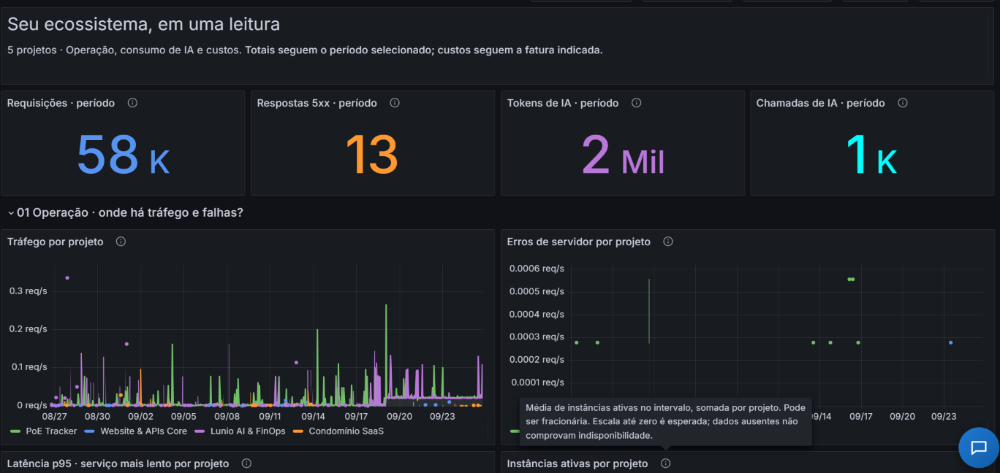
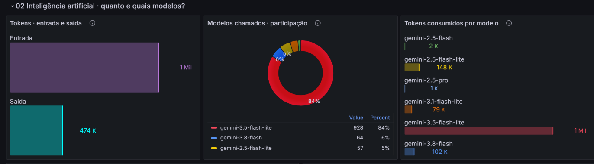
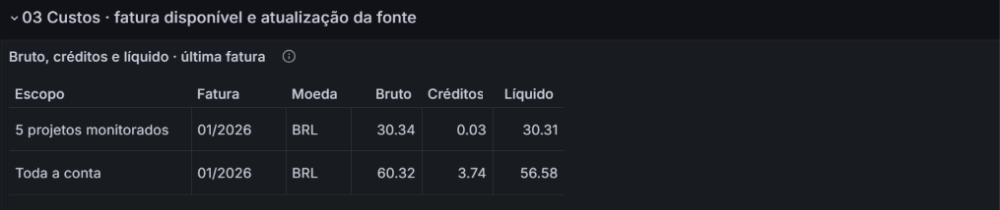
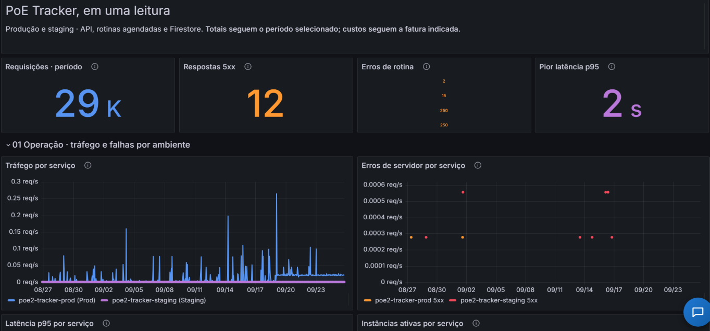
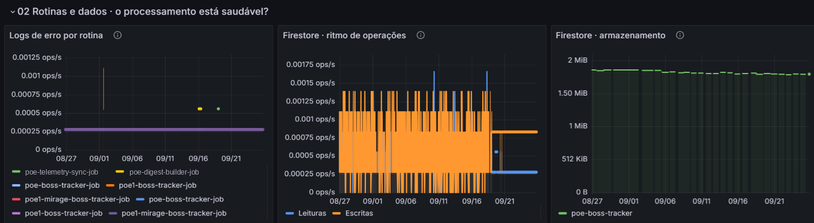

# AI-Ops Copilot: Autonomous SRE & Multi-Project Observability Sidecar

[](https://github.com/juanmh10/ai-ops-copilot/actions/workflows/ci.yml)
[](https://go.dev/)
[](https://grafana.com/)
[](https://cloud.google.com/run)
[](https://cloud.google.com/vertex-ai)
[](LICENSE)

An enterprise-grade, **autonomous Site Reliability Engineering (SRE) copilot** and multi-project observability platform designed to run as a serverless **sidecar microservice** coupled to **Grafana OSS** on Google Cloud Platform (GCP).

The copilot provides real-time, context-aware operational intelligence across multiple interconnected GCP projects, combining automated telemetry analysis, log triage, FinOps billing tracking, and synthetic uptime verification directly within the active Grafana dashboard interface.

---

## High-Level Architecture



> For the comprehensive multi-project GCP/Firebase topology and declarative architecture diagram, see [ARCHITECTURE_DIAGRAM.md](ARCHITECTURE_DIAGRAM.md) and [ARCHITECTURE.md](ARCHITECTURE.md).

---

## Key Engineering Highlights

### 1. Dual-Engine Autonomous GenAI Agent (Go 1.23)
* Built strictly in Go 1.23 using the official **`google.golang.org/genai`** SDK with **`genai.BackendVertexAI`** and fallback support for Google AI Developer API.
* **100% Read-Only Safety Guardrails:** Implements strict Function Calling tools (`QueryCloudMonitoring`, `QueryCloudLogging`, `GetDashboardMetrics`, `QueryBillingCosts`, `GetFirestoreDigest`). Zero write/mutation capabilities.
* **Dynamic Scope Resolution:** Automatically resolves query context between global infrastructure scope and specific project domains based on explicit prompts and active screen parameters.

### 2. Context-Aware Grafana App Plugin (React + TypeScript)
* Custom Grafana frontend extension packaged as an app plugin.
* Intercepts and parses URL state, active dashboard UID, selected panels, and time range to provide untrusted, factual context directly to Gemini's prompt.
* Floating interactive drawer widget built with pure ES2020 modules and SystemJS loader compatibility.

### 3. Serverless Multi-Container Sidecar on Cloud Run v2
* Single deployable unit encapsulating Grafana OSS and the Go backend sidecar.
* The Go backend serves as the ingress point (port 8080), reverse-proxying Grafana assets and API endpoints to `localhost:3000` while serving `/api/chat` and `/api/healthz` natively.
* **Strict FinOps & Zero Idle Cost (`minScale: 0`):** Both containers scale down to zero when idle, waking up in sub-seconds upon authorized traffic.

### 4. Idempotent Programmatic Dashboard Generator
* Declarative dashboard-as-code generator written in Go (`monitoring/cmd/render-grafana-dashboards/`).
* Synchronizes and renders 6 comprehensive JSON dashboards with zero manual drift.
* Automated tests guarantee byte-for-byte idempotent generation.

---

## Visual Dashboard Showcase

The observability platform features pre-configured, declarative Grafana dashboards designed under the strict 24-column grid contract ([`monitoring/DASHBOARD-DESIGN.md`](monitoring/DASHBOARD-DESIGN.md)):

### 1. Unified Multi-Project Overview (`unified-cloudrun-ops`)
Aggregates operational KPIs, cross-project traffic rates, and server errors across all supervised domains. Notice the unobtrusive blue floating **AI-Ops Copilot launcher widget** in the bottom-right corner.



### 2. Vertex AI Token Consumption & Model Distribution
Detailed breakdown of generative AI throughput: comparing input versus output tokens (1M vs 474K), model invocation share, and comparative token consumption across Gemini model versions (including `gemini-3.8-flash` and `gemini-3.5-flash-lite`).



### 3. FinOps & Multi-Project Billing Transparency
Automated BigQuery billing export aggregation comparing the 5 monitored projects against the total Google Cloud billing account footprint, isolating gross spend, applied credits, and net amounts with explicit currency tracking.



### 4. Project-Level Telemetry & Environment Isolation
Deep-dive view (`aiops-telemetry-prod`) contrasting production and staging services, displaying traffic rates, 5xx server error spikes, p95 request latencies, and active container instances.



### 5. Scheduled Background Jobs & Firestore Health
Observability for asynchronous and scheduled tasks: tracking Cloud Scheduler execution errors, real-time Cloud Firestore read/write operations per second, and database storage growth over time.



---

## Repository Topology

```text
├── agent-backend/              # Go 1.23 autonomous agent sidecar
│   ├── cmd/server/             # HTTP server, proxy router, entrypoint
│   ├── internal/agent/         # Prompt engineering, scope resolver, GenAI loop
│   ├── internal/tools/         # Read-only GCP telemetry & billing tools
│   ├── internal/memory/        # Firestore session persistence
│   └── Dockerfile              # Multi-stage distroless build (< 25MB)
├── grafana-plugin/             # React/TypeScript custom Copilot plugin
│   ├── src/components/         # Chat drawer, message threads, markdown renderers
│   ├── src/context/            # DOM & URL dashboard context capture
│   └── package.json            # Build scripts (esbuild + rollup SystemJS)
├── grafana-provisioning/       # Provisioning configuration
│   ├── dashboards/             # Unified dashboard suite JSONs
│   └── datasources/            # Cloud Monitoring & BigQuery datasources
├── monitoring/                 # Declarative Observability & Design System
│   ├── cmd/render-dashboards/  # Go generator for reproducible dashboards
│   ├── policies/               # Alerting policies and uptime checks
│   ├── DASHBOARD-DESIGN.md     # Approved UX & Metric Design Contract
│   └── metrics-catalog.json    # Human vs Agent metric cardinality catalog
├── terraform/ops-copilot/      # Production Terraform HCL infrastructure
│   ├── cloud_run.tf            # Multi-container service definition
│   ├── iam.tf                  # Principle of least privilege service accounts
│   ├── storage.tf              # Cloud Storage bucket for GCS FUSE
│   └── cd_identity.tf          # Workload Identity Federation (WIF)
├── docs/assets/                # Project media, architecture diagrams & UI screenshots
├── docker-compose.yml          # Local development & mock emulation stack
└── Dockerfile.grafana          # Reproducible Grafana image with pre-installed plugins
```

---

## Architecture & Specifications

Detailed architectural documents, governance rules, and system design specifications:

* **[Technical Architecture](ARCHITECTURE.md):** Cloud Run multi-container pod design, reverse proxy routing, Vertex AI integration, and persistence architecture.
* **[Infrastructure Topology Diagram](ARCHITECTURE_DIAGRAM.md):** Complete multi-project GCP/Firebase topology and declarative Mermaid diagram.
* **[Product Requirements](REQUIREMENTS.md):** Functional requirements (FR01–FR05) and non-functional security/FinOps standards.
* **[AI Agent Governance (`AGENTS.md`)](AGENTS.md):** Guardrails, development constraints, and software engineering standards for autonomous agents working on this repository.
* **[Dashboard Design Contract](monitoring/DASHBOARD-DESIGN.md):** 24-column grid layout rules, metric semantics, and UX conventions for Grafana dashboards.
* **[Assets & Screenshots Catalog](docs/assets/README.md):** Directory catalog for visual architecture diagrams and UI screenshots.


---

## Quickstart: Local Development

Run the entire ecosystem locally with mock telemetry and Firestore emulation without requiring live GCP credentials:

```bash
# 1. Clone the repository
git clone https://github.com/juanmh10/ai-ops-copilot.git
cd ai-ops-copilot

# 2. Build the Grafana plugin bundle
cd grafana-plugin
npm ci
npm run build
cd ..

# 3. Start the local stack via Docker Compose
docker compose up --build
```

Access the services:
* **Grafana UI + Copilot Sidecar:** [http://localhost:3000](http://localhost:3000) (Default user: `admin`, password: `AdminSecurePassword2026!`)
* **Agent Backend Direct Health Check:** [http://localhost:8080/healthz](http://localhost:8080/healthz)

---

## Testing & Quality Gates

Run the automated test suites:

```bash
# Go Agent Backend Unit Tests
cd agent-backend
go test -v -race ./...

# Dashboard Generator Idempotency Tests
cd ../monitoring/cmd/render-grafana-dashboards
go test -v ./...

# Grafana Plugin TypeScript & Context Tests
cd ../../../grafana-plugin
npm test

# Terraform HCL Syntax & Provider Validation
cd ../terraform/ops-copilot
terraform init -backend=false
terraform fmt -check
terraform validate
```

---

## License

Licensed under the Apache License, Version 2.0. See [LICENSE](LICENSE) for details.
